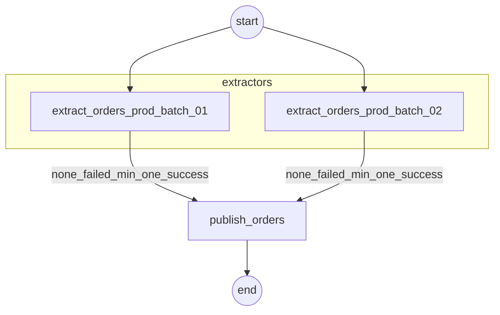

## example_general_workflow prod run

```mermaid
flowchart TD
  %% example_general_workflow prod run
  wf_start((start))
  wf_end((end))
  subgraph g_extractors["extractors"]
    n_extract_orders_prod_batch_01["extract_orders_prod_batch_01"]
    n_extract_orders_prod_batch_02["extract_orders_prod_batch_02"]
  end
  n_publish_orders["publish_orders"]
  n_extract_orders_prod_batch_01 -->|none_failed_min_one_success| n_publish_orders
  n_extract_orders_prod_batch_02 -->|none_failed_min_one_success| n_publish_orders
  wf_start --> n_extract_orders_prod_batch_01
  wf_start --> n_extract_orders_prod_batch_02
  n_publish_orders --> wf_end
```