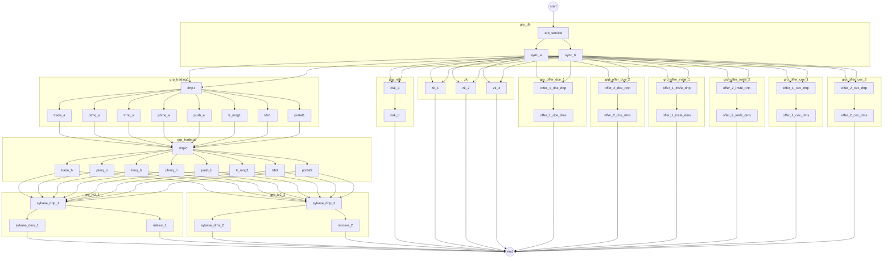

## screenshot_workflow_draft qa start

```mermaid
flowchart TD
  %% screenshot_workflow_draft qa start
  wf_start((start))
  wf_end((end))
  subgraph g_grp_db["grp_db"]
    n_arb_service["arb_service"]
    n_sync_a["sync_a"]
    n_sync_b["sync_b"]
  end
  subgraph g_grp_trading1["grp_trading1"]
    n_drtp1["drtp1"]
    n_trade_a["trade_a"]
    n_ptmq_a["ptmq_a"]
    n_trmq_a["trmq_a"]
    n_phmq_a["phmq_a"]
    n_push_a["push_a"]
    n_tr_mng1["tr_mng1"]
    n_tds1["tds1"]
    n_portal1["portal1"]
  end
  subgraph g_grp_trading2["grp_trading2"]
    n_drtp2["drtp2"]
    n_trade_b["trade_b"]
    n_ptmq_b["ptmq_b"]
    n_trmq_b["trmq_b"]
    n_phmq_b["phmq_b"]
    n_push_b["push_b"]
    n_tr_mng2["tr_mng2"]
    n_tds2["tds2"]
    n_portal2["portal2"]
  end
  subgraph g_grp_lv2_1["grp_lv2_1"]
    n_sybase_drtp_1["sybase_drtp_1"]
    n_sybase_dms_1["sybase_dms_1"]
    n_risksvr_1["risksvr_1"]
  end
  subgraph g_grp_lv2_2["grp_lv2_2"]
    n_sybase_drtp_2["sybase_drtp_2"]
    n_sybase_dms_2["sybase_dms_2"]
    n_monsvr_2["monsvr_2"]
  end
  subgraph g_grp_risk["grp_risk"]
    n_risk_a["risk_a"]
    n_risk_b["risk_b"]
  end
  subgraph g_zk["zk"]
    n_zk_1["zk_1"]
    n_zk_2["zk_2"]
    n_zk_3["zk_3"]
  end
  subgraph g_grp_offer_dce_1["grp_offer_dce_1"]
    n_offer_1_dce_drtp["offer_1_dce_drtp"]
    n_offer_1_dce_dms["offer_1_dce_dms"]
  end
  subgraph g_grp_offer_dce_2["grp_offer_dce_2"]
    n_offer_2_dce_drtp["offer_2_dce_drtp"]
    n_offer_2_dce_dms["offer_2_dce_dms"]
  end
  subgraph g_grp_offer_insfe_1["grp_offer_insfe_1"]
    n_offer_1_insfe_drtp["offer_1_insfe_drtp"]
    n_offer_1_insfe_dms["offer_1_insfe_dms"]
  end
  subgraph g_grp_offer_insfe_2["grp_offer_insfe_2"]
    n_offer_2_insfe_drtp["offer_2_insfe_drtp"]
    n_offer_2_insfe_dms["offer_2_insfe_dms"]
  end
  subgraph g_grp_offer_cex_1["grp_offer_cex_1"]
    n_offer_1_cex_drtp["offer_1_cex_drtp"]
    n_offer_1_cex_dms["offer_1_cex_dms"]
  end
  subgraph g_grp_offer_cex_2["grp_offer_cex_2"]
    n_offer_2_cex_drtp["offer_2_cex_drtp"]
    n_offer_2_cex_dms["offer_2_cex_dms"]
  end
  wf_start --> n_arb_service
  n_arb_service --> n_sync_a
  n_arb_service --> n_sync_b
  n_sync_a --> n_drtp1
  n_sync_b --> n_drtp1
  n_drtp1 --> n_trade_a
  n_drtp1 --> n_ptmq_a
  n_drtp1 --> n_trmq_a
  n_drtp1 --> n_phmq_a
  n_drtp1 --> n_push_a
  n_drtp1 --> n_tr_mng1
  n_drtp1 --> n_tds1
  n_drtp1 --> n_portal1
  n_trade_a --> n_drtp2
  n_ptmq_a --> n_drtp2
  n_trmq_a --> n_drtp2
  n_phmq_a --> n_drtp2
  n_push_a --> n_drtp2
  n_tr_mng1 --> n_drtp2
  n_tds1 --> n_drtp2
  n_portal1 --> n_drtp2
  n_drtp2 --> n_trade_b
  n_drtp2 --> n_ptmq_b
  n_drtp2 --> n_trmq_b
  n_drtp2 --> n_phmq_b
  n_drtp2 --> n_push_b
  n_drtp2 --> n_tr_mng2
  n_drtp2 --> n_tds2
  n_drtp2 --> n_portal2
  n_trade_b --> n_sybase_drtp_1
  n_ptmq_b --> n_sybase_drtp_1
  n_trmq_b --> n_sybase_drtp_1
  n_phmq_b --> n_sybase_drtp_1
  n_push_b --> n_sybase_drtp_1
  n_tr_mng2 --> n_sybase_drtp_1
  n_tds2 --> n_sybase_drtp_1
  n_portal2 --> n_sybase_drtp_1
  n_sybase_drtp_1 --> n_sybase_dms_1
  n_sybase_drtp_1 --> n_risksvr_1
  n_trade_b --> n_sybase_drtp_2
  n_ptmq_b --> n_sybase_drtp_2
  n_trmq_b --> n_sybase_drtp_2
  n_phmq_b --> n_sybase_drtp_2
  n_push_b --> n_sybase_drtp_2
  n_tr_mng2 --> n_sybase_drtp_2
  n_tds2 --> n_sybase_drtp_2
  n_portal2 --> n_sybase_drtp_2
  n_sybase_drtp_2 --> n_sybase_dms_2
  n_sybase_drtp_2 --> n_monsvr_2
  n_sync_a --> n_risk_a
  n_sync_b --> n_risk_a
  n_risk_a --> n_risk_b
  n_sync_a --> n_zk_1
  n_sync_b --> n_zk_1
  n_sync_a --> n_zk_2
  n_sync_b --> n_zk_2
  n_sync_a --> n_zk_3
  n_sync_b --> n_zk_3
  n_sync_a --> n_offer_1_dce_drtp
  n_sync_b --> n_offer_1_dce_drtp
  n_offer_1_dce_drtp --> n_offer_1_dce_dms
  n_sync_a --> n_offer_2_dce_drtp
  n_sync_b --> n_offer_2_dce_drtp
  n_offer_2_dce_drtp --> n_offer_2_dce_dms
  n_sync_a --> n_offer_1_insfe_drtp
  n_sync_b --> n_offer_1_insfe_drtp
  n_offer_1_insfe_drtp --> n_offer_1_insfe_dms
  n_sync_a --> n_offer_2_insfe_drtp
  n_sync_b --> n_offer_2_insfe_drtp
  n_offer_2_insfe_drtp --> n_offer_2_insfe_dms
  n_sync_a --> n_offer_1_cex_drtp
  n_sync_b --> n_offer_1_cex_drtp
  n_offer_1_cex_drtp --> n_offer_1_cex_dms
  n_sync_a --> n_offer_2_cex_drtp
  n_sync_b --> n_offer_2_cex_drtp
  n_offer_2_cex_drtp --> n_offer_2_cex_dms
  n_sybase_dms_1 --> wf_end
  n_risksvr_1 --> wf_end
  n_sybase_dms_2 --> wf_end
  n_monsvr_2 --> wf_end
  n_risk_b --> wf_end
  n_zk_1 --> wf_end
  n_zk_2 --> wf_end
  n_zk_3 --> wf_end
  n_offer_1_dce_dms --> wf_end
  n_offer_2_dce_dms --> wf_end
  n_offer_1_insfe_dms --> wf_end
  n_offer_2_insfe_dms --> wf_end
  n_offer_1_cex_dms --> wf_end
  n_offer_2_cex_dms --> wf_end
```