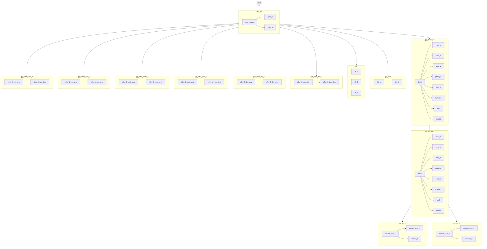
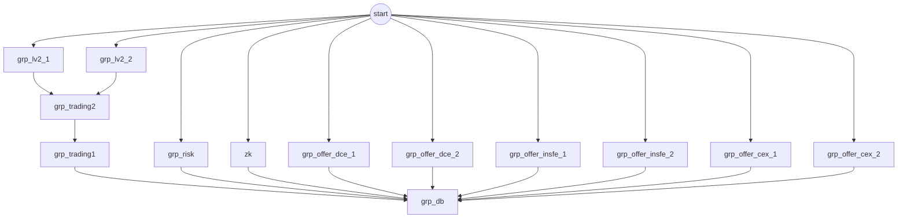

# screenshot_workflow_draft Airflow Graph Preview

Source config: `dags/remote_workflows/screenshot_workflow_draft.json`

The workflow parses successfully for `dev`, `qa`, `prod`, and `dr`.

- `dev`: 38 logical tasks, 10 task groups.
- `qa`, `prod`, `dr`: 44 logical tasks, 13 task groups.
- Airflow creates one remote operation per logical task and host, named like `run__{task_id}__{host}`.

## Start DAG, Collapsed TaskGroup View

`qa`, `prod`, and `dr` include all offer groups shown below. `dev` only includes the `_1` offer groups because the draft JSON defines only one host for each offer name in `dev`.

## Stop DAG, Collapsed TaskGroup View

No explicit `stop_depends_on` graph is defined in this draft, so the stop DAG uses the reversed start graph.

## Status DAG

The status DAG has no workflow dependency ordering. All active logical tasks for the selected environment are independently gated by the Airflow UI selection parameters, then each task fans out to its host operation tasks.
