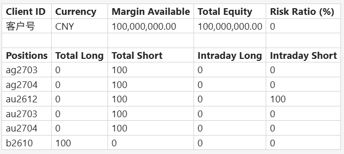

# Initial Requirements

We need to build a web application based on the vendor-provided TDS package.

The vendor provides:
- C/C++ header files
- Linux `.so` shared libraries, Windows dll and lib libraries
- Example C++ files
- more details, please refer to tds folder and tds_reporter folder, which are used for another tds reporting feature

The system should provide a web UI where users can query client-related TDS data.

Users should be able to open the web page directly from permitted network locations. Access is controlled by an IP whitelist.

The user should be able to input or select a client ID or Name and query the client's data.

The query result should show exactly same data and structure in below snapshot, the look and feel can be different.

the page also need to provide a way to copy the content and later paste to excel with same format.

Out of scope for initial version:
- User self-service admin page
- Complex entitlement management
- Editing TDS data
- Mobile-specific UI
- Full production HA design
