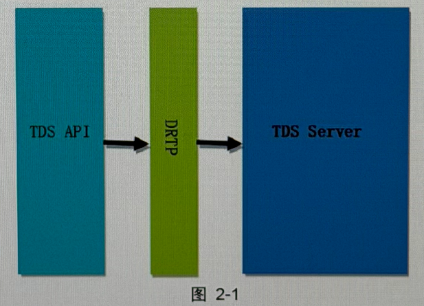
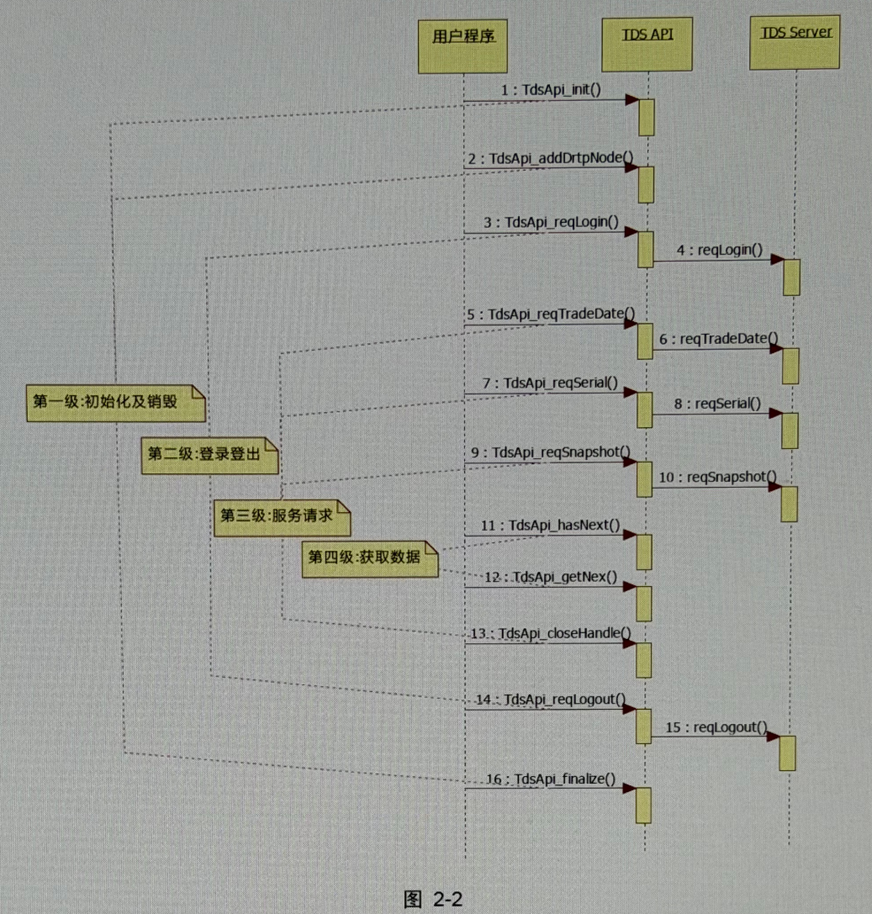

# TDS API 接口文档（由 14 张截图重建）

> 说明  
> 这份 Markdown 面向 **Codex / LLM / 代码代理** 使用，按原始截图内容重建为结构化文本。  
> 你已自行整理 `include/` 和 `examples/` 里的源码文件，因此本文件重点保留 **PDF 中的说明文字、接口说明、调用流程、参数解释与注意事项**。  
> 为尽量避免信息遗漏，文末附上 **14 张原始截图索引** 以供人工核对。

---

## 1. 引言

### 1.1 概述

本文档主要介绍 TDS API 接口及其使用方法。

### 1.2 接口介绍

TDS API 主要是一套从交易系统获取流水和快照的接口，它提供一套接口开发包供用户使用。  
Windows 版和 Linux 版的接口开发包包含下列文件：

| 文件 | 功能 |
|---|---|
| `tds_api.h` | TDS 接口的定义 |
| `tds_api_define.h` | TDS 宏和类型的定义 |
| `tds_api_struct_type.h` | TDS 数据结构体的定义 |
| `tds_api_error.h` | TDS 错误码定义 |
| `tds_api.dll` | Windows 动态链接库文件 |
| `tds_api.lib` | 导入库文件 |
| `tds_api.so` | Linux 动态链接库文件 |

---

## 2. 系统简介

### 2.1 整体架构



整个 TDS 的架构如图 2-1 所示，其中：

- **TDS API**：接口开发包
- **DRTP**：通信平台
- **TDS Server**：后台提供的服务（例如：登录、登出、快照、流水等服务）

TDS API 通过通信平台访问后台提供的服务。

### 2.2 使用流程

TDS API 库中接口的使用如下图所示（原图为时序图）：



1. `TdsApi_init()`
2. `TdsApi_addDrtpNode()`
3. `TdsApi_reqLogin()`
4. 后台 `reqLogin()`
5. `TdsApi_reqTradeDate()`
6. 后台 `reqTradeDate()`
7. `TdsApi_reqSerial()`
8. 后台 `reqSerial()`
9. `TdsApi_reqSnapshot()`
10. 后台 `reqSnapshot()`
11. `TdsApi_hasNext()`
12. `TdsApi_getNext()`
13. `TdsApi_closeHandle()`
14. `TdsApi_reqLogout()`
15. 后台 `reqLogout()`
16. `TdsApi_finalize()`

从图 2-2 中可以看出，TDS API 的使用分为四个级别：

- **第一级：初始化及销毁**
- **第二级：登录登出**
- **第三级：服务请求**
- **第四级：获取数据**

在使用 TDS API 之前，需要先依次调用 `TdsApi_init` 和 `TdsApi_addDrtpNode` 完成初始化；  
然后，调用 `TdsApi_reqLogin` 完成登录操作；  
登录成功后，就可以访问后台提供的服务了；  
对于流水和快照，数据请求和获取是分开的，需要先使用 `TdsApi_reqSerial` 或 `TdsApi_reqSnapshot` 进行数据请求，然后使用类似下面的方式获取数据：

```cpp
while (TdsApi_hasNext(...))   // 判断是否有数据
{
    TdsApi_getNext(...);      // 获取数据
}
```

如果使用了异步通知功能，获取数据的方式改为函数回调，具体使用方式请参考异步通知接口说明和 `tds_api_demo`。

新版本的 API 提供了用户订阅功能接口 `TdsApi_subscribeDataByCust`，如果只需要关心特定某些客户数据，可以在数据请求前调用此接口，具体用法后面的接口使用。  
不调用此接口则为全用户数据，同时订阅客户数据后也可以退订（见退订接口）；注意：把订阅过的客户都退订后，将无用户数据返回。

另外，每一级的 API 都有对应的销毁或关闭接口，用于释放该级别的资源。  
下面将详细介绍这些接口的使用。

---

## 3. 接口说明

### 3.1. TdsApi_getVersion

**功能：**  
获取 TDS API 库的版本信息和构建信息。

**原型：**

```cpp
bool TdsApi_getVersion(
    char* version,
    int len
);
```

**参数：**

- `version`  
  输出参数，用于保存 TDS API 库的版本号
- `len`  
  输入参数，`version` 的最大缓冲长度

**返回值：**

- `true` 表示成功
- `false` 表示失败

**说明：**  
`TdsApi_getVersion` 获取 TDS API 库的版本号，通过 `version` 返回版本号，如果 `version` 的缓冲长度不足则返回 `false`。

**实例：**  
请参考 `tds_api_demo`

---

### 3.2. TdsApi_init

**功能：**  
初始化 TDS API 库

**原型：**

```cpp
bool TdsApi_init(
    int req_timeout,
    int log_level,
    int function_no,
    int *err_code,
    char *err_msg
);
```

> 备注：你前面整理的头文件里还出现了 `klg_enable` 参数；这里严格按截图中的 PDF 说明页重建。

**参数：**

- `req_timeout`  
  输入参数，请求的超时时间，以毫秒为单位，请求的超时时间最好大于 `60000`
- `log_level`  
  输入参数，日志级别，大于该级别的日志输出  
  `6000-致命 5000-错误 4000-警告 3000-信息 2000-调试 0-全部`
- `function_no`  
  输入参数，门户的功能号
- `err_code`  
  输出参数，错误时，返回的错误码
- `err_msg`  
  输出参数，错误时，返回的错误信息

**返回值：**

- `true` 表示初始化成功
- `false` 表示失败

**说明：**  
在调用 TDS API 库中其它函数之前，需要先使用 `TdsApi_init` 初始化 TDS API 库，当初始化成功后就可以使用 TDS API 提供的其它接口了；如果失败，则系统会将错误原因及相关的错误信息放在 `err_code` 和 `err_msg` 中。  
此接口在整个进程空间只需调用一次。  
当不再使用该库时，需要调用 `TdsApi_finalize` 销毁库。

**实例：**  
请参考 `tds_api_demo`

---

### 3.3. TdsApi_addDrtpNode

**功能：**  
增加一个接入点

**原型：**

```cpp
Bool TdsApi_addDrtpNode(
    const char *ip,
    int port
);
```

**参数：**

- `ip`  
  输入参数，DRTP 服务端的 IP 地址
- `port`  
  输入参数，DRTP 服务端的端口号

**返回值：**

- `True` 表示成功，`false` 表示失败

**说明：**  
在调用 TDS API 接口进行登录、获取流水或快照前，必须先调用此接口告诉 TDS API 如何连接到 DRTP 通信网络，成功后就可以与 TDS 后台进行交互。

**实例：**  
请参考 `tds_api_demo`

---

### 3.4. TdsApi_finalize

**功能：**  
销毁 TDS API 库

**原型：**

```cpp
void TdsApi_finalize();
```

**参数：**  
无

**返回值：**  
无

**说明：**  
在使用 `TdsApi_init` 初始化 TDS API 库后，当不再使用该库时，需要调用此接口销毁库。

**实例：**  
请参考 `tds_api_demo`

---

### 3.5. TdsApi_reqLogin

**功能：**  
用户登录

**原型：**

```cpp
int TDS_API TdsApi_reqLogin(
    const char *user_name,
    const char *passwd,
    int *err_code,
    char *err_msg
);
```

**参数：**

- `user_name`  
  输入参数，用户名
- `passwd`  
  输入参数，用户密码
- `err_code`  
  输出参数，错误时，返回的错误码
- `err_msg`  
  输出参数，错误时，返回的错误信息

**返回值：**

- `0` 表示成功，其它表示失败

**说明：**  
在获取快照或流水之前，需要先使用此接口登录 TDS 系统，当登录成功后就可以使用 TDS API 提供的接口获取快照或流水了；如果失败，则系统会将错误原因及相关的错误信息放在 `err_code` 和 `err_msg` 中。  
登录 TDS 系统后，如果不再需要使用 TDS 相关的服务了，则需要使用 `TdsApi_reqLogout` 登出 TDS 系统。

**实例：**  
请参考 `tds_api_demo`

---

### 3.6. TdsApi_reqLogout

**功能：**  
用户登出

**原型：**

```cpp
int TDS_API TdsApi_reqLogout(
    int *err_code,
    char *err_msg
);
```

**参数：**

- `err_code`  
  输出参数，错误时，返回的错误码
- `err_msg`  
  输出参数，错误时，返回的错误信息

**返回值：**

- `0` 表示成功，其它表示失败

**说明：**  
登录 TDS 系统后，可使用该接口登出 TDS 系统，登出后，用户将无法继续使用 TDS 提供的服务（除非再次登录 TDS 系统），如果登出失败，则系统会将错误原因及相关的错误信息放在 `err_code` 和 `err_msg` 中。

**实例：**  
请参考 `tds_api_demo`

---

### 3.7. TdsApi_reqTradeDate

**功能：**  
查询当前交易日

**原型：**

```cpp
int TdsApi_reqTradeDate(
    int *trade_date,
    int *err_code,
    char *err_msg
);
```

**参数：**

- `trade_date`  
  输出参数，返回当前的交易日期
- `err_code`  
  输出参数，错误时，返回的错误码
- `err_msg`  
  输出参数，错误时，返回的错误信息

**返回值：**

- `0` 表示成功，其它表示失败

**说明：**  
此接口用于从 TDS 服务器中获取当前交易日期（需要先登录 TDS 系统），如果失败，则系统会将错误原因及相关的错误信息放在 `err_code` 和 `err_msg` 中。

**实例：**  
请参考 `tds_api_demo`

---

### 3.8. TdsApi_reqSerial

**功能：**  
请求流水

**原型：**

```cpp
TDS_HANDLE TdsApi_reqSerial(
    int serial_id,
    int seq_no,
    int *err_code,
    char *err_msg
);
```

**参数：**

- `serial_id`  
  输入参数，流水数据的编号
- `seq_no`  
  输入参数，起始流水序号，从 `0` 开始计算
- `err_code`  
  输出参数，错误时，返回的错误码
- `err_msg`  
  输出参数，错误时，返回的错误信息

**返回值：**

- 成功返回请求句柄，失败返回 `NULL`

**说明：**  
此接口用于向 TDS 服务器请求流水（需要先登录 TDS 系统），如果成功则返回请求句柄，该句柄会在 `TdsApi_hasNext` 和 `TdsApi_getNext` 中用于获取数据；如果失败，则系统会返回 `NULL` 并将错误原因及相关的错误信息放在 `err_code` 和 `err_msg` 中。

`serial_id` 在文件 `tds_api_define.h` 中有定义，含义如下：

| 值 | 含义 |
|---|---|
| `TDS_SERIAL_ID_TRADE` | 获取交易的流水 |
| `TDS_SERIAL_ID_PORTAL` | 获取门户的流水 |

当查询结束时，需要使用 `TdsApi_closeHandle` 关闭请求句柄。

**实例：**  
请参考 `tds_api_demo`

---

### 3.9. TdsApi_reqSnapshot

**功能：**  
请求快照

**原型：**

```cpp
TDS_HANDLE TdsApi_reqSnapshot(
    int trade_date,
    int table_id,
    int *err_code,
    char *err_msg
);
```

**参数：**

- `trade_date`  
  输入参数，请求哪一个交易日的快照
- `table_id`  
  输入参数，所请求快照的 ID
- `err_code`  
  输出参数，错误时，返回的错误码
- `err_msg`  
  输出参数，错误时，返回的错误信息

**返回值：**

- 成功返回请求句柄，失败返回 `NULL`

**说明：**  
此接口用于向 TDS 服务器请求快照（需要先登录 TDS 系统），如果成功则返回请求句柄，该句柄会在 `TdsApi_hasNext` 和 `TdsApi_getNext` 中用于获取数据；如果失败，则系统会返回 `NULL` 并将错误原因及相关的错误信息放在 `err_code` 和 `err_msg` 中。  

`trade_date` 以十进制数字表示日期，比如 2010 年 7 月 23 日，可使用 `"20100723"` 表示，其中年为 4 位，月和日各占 2 位；`table_id` 在文件 `tds_api_define.h` 中有相应的定义。  

当查询结束时，需要使用 `TdsApi_closeHandle` 关闭请求句柄。

**实例：**  
请参考 `tds_api_demo`

---

### 3.10. TdsApi_reqSeatFund

**功能：**  
请求席位资金信息

**原型：**

```cpp
TDS_HANDLE TdsApi_reqSeatFund(
    char *tunnel_code,
    char *currency_code,
    int *err_code,
    char *err_msg
);
```

**参数：**

- `tunnel_code`  
  输入参数，请求哪一个席位的数据
- `currency_code`  
  输入参数，所请求信息的币种
- `err_code`  
  输出参数，错误时，返回的错误码
- `err_msg`  
  输出参数，错误时，返回的错误信息

**返回值：**

- 成功返回请求句柄，失败返回 `NULL`

**说明：**  
此接口用于向 TDS 服务器请求席位资金信息（需要先登录 TDS 系统），如果成功则返回请求句柄，该句柄会在 `TdsApi_hasNext` 和 `TdsApi_getNext` 中用于获取数据；如果失败，则系统会返回 `NULL` 并将错误原因及相关的错误信息放在 `err_code` 和 `err_msg` 中。  

`tunnel_code` 参照 `tt_exch_tunnel`，查询对应席位编码；`currency_code` 目前仅支持输入 `"1"`（人民币）和 `"2"`（美元），见 `tds_api_defin.h`。  
当查询结束时，需要使用 `TdsApi_closeHandle` 关闭请求句柄。

**实例：**  
请参考 `tds_api_demo`

---

### 3.11. TdsApi_hasNext

**功能：**  
查询是否还有数据

**原型：**

```cpp
bool TdsApi_hasNext(
    TDS_HANDLE handle,
    int *err_code,
    char *err_msg
);
```

**参数：**

- `handle`  
  输入参数，请求句柄
- `err_code`  
  输出参数，错误时，返回的错误码
- `err_msg`  
  输出参数，错误时，返回的错误信息

**返回值：**

- `true` 表示成功，`false` 表示失败

**说明：**  
此接口用于查询是否还有数据（需要先登录 TDS 系统），如果有则返回成功，如果失败，则系统会将错误原因及相关的错误信息放在 `err_code` 和 `err_msg` 中。

**实例：**  
请参考 `tds_api_demo`

---

### 3.12. TdsApi_getNext

**功能：**  
获取数据

**原型：**

```cpp
bool TdsApi_getNext(
    TDS_HANDLE handle,
    int *data_type,
    char *data_value,
    int data_size,
    int *err_code,
    char *err_msg
);
```

**参数：**

- `handle`  
  输入参数，请求句柄
- `data_type`  
  输出参数，数据类型
- `data_value`  
  输出参数，数据值
- `data_size`  
  输入参数，`data_value` 的最大缓冲长度
- `err_code`  
  输出参数，错误时，返回的错误码
- `err_msg`  
  输出参数，错误时，返回的错误信息

**返回值：**

- `true` 表示成功，`false` 表示失败

**说明：**  
此接口用于获取数据（需要先登录 TDS 系统），获取成功后，会将数据类型返回给 `data_type`（在文件 `tds_api_struct_type.h` 中定义），并将数据的值返回给 `data_value`；如果失败，则系统会将错误原因及相关的错误信息放在 `err_code` 和 `err_msg` 中。

**实例：**  
请参考 `tds_api_demo`

---

### 3.13. TdsApi_closeHandle

**功能：**  
关闭请求句柄

**原型：**

```cpp
void TdsApi_closeHandle(
    TDS_HANDLE handle
);
```

**参数：**

- `handle`  
  输入参数，请求句柄

**返回值：**  
无

**说明：**  
此接口用于关闭请求句柄

**实例：**  
请参考 `tds_api_demo`

---

### 3.14. TdsApi_enableAsyncNotify

**功能：**  
使能异步通知功能

**原型：**

```cpp
bool TDS_API TdsApi_enableAsyncNotify(
    TDS_HANDLE handle,
    TdsApiCB_OnDataReceived on_data_received,
    TdsApiCB_OnNoMoreData on_no_more_data,
    TdsApiCB_OnError on_error,
    int *err_code,
    char *err_msg
);
```

**参数：**

- `handle`  
  输入参数，请求句柄
- `on_data_received`  
  输入参数，用户数据返回时回调函数指针
- `on_no_more_data`  
  输入参数，用户数据结束时回调函数指针
- `on_error`  
  输入参数，用户请求过程中出现错误时回调函数指针
- `err_code`  
  输出参数，错误时，返回的错误码
- `err_msg`  
  输出参数，错误时，返回的错误信息

**返回值：**

- `true` 表示成功，`false` 表示失败

**说明：**  
使用异步通知功能，这时请不要再使用 `TdsApi_hasNext`、`TdsApi_getNext`，成功返回 `true`，如果出错，错误信息见 `err_code` 和 `err_msg`；回调函数指针原型申明及注意事项见 `tds_api.h` 说明。

**实例：**  
请参考 `tds_api_demo`

---

### 3.15. TdsApi_subscribeDataByCust

**功能：**  
按客户号订阅数据流

**原型：**

```cpp
bool TDS_API TdsApi_subscribeDataByCust(
    const char *subscribeCustNoList,
    int *err_code,
    char *err_msg
);
```

**参数：**

- `subscribeCustNoList`  
  输入参数，订阅的客户号列表，每个客户号用 `'|'` 分割开
- `err_code`  
  输出参数，错误时，返回的错误码
- `err_msg`  
  输出参数，错误时，返回的错误信息

**返回值：**

- `true` 表示成功，`false` 表示失败

**说明：**  
调用本函数可实现按客户号订阅数据流，不调用此函数时，为全客户数据流，成功返回 `true`，如果出错，错误信息见 `err_code` 和 `err_msg`。

**实例：**  
请参考 `tds_api_demo`

---

### 3.16. TdsApi_unsubscribeDataByCust

**功能：**  
按客户号退订数据流，配合订阅数据流函数使用

**原型：**

```cpp
bool TDS_API TdsApi_unsubscribeDataByCust(
    const char *unsubscribeCustNoList,
    int *err_code,
    char *err_msg
);
```

**参数：**

- `unsubscribeCustNoList`  
  输入参数，退订的客户号列表，每个客户号用 `'|'` 分割开
- `err_code`  
  输出参数，错误时，返回的错误码
- `err_msg`  
  输出参数，错误时，返回的错误信息

**返回值：**

- `true` 表示成功，`false` 表示失败

**说明：**  
本函数配合 `SubscribeByCust` 使用，退订无订阅的客户号无意义，成功返回 `true`，如果出错，错误信息见 `err_code` 和 `err_msg`。

**实例：**  
请参考 `tds_api_demo`

---

## 4. 对 Codex 友好的使用建议

因为你已经自己整理了：

- `include/` 目录里的头文件
- `examples/` 目录里的示例 `.cpp`

这份 Markdown 最适合放在仓库中作为：

- `docs/tds_api.md`
- 或 `README-API.md`

建议搭配目录结构：

```text
project-root/
├─ include/
│  ├─ tds_api.h
│  ├─ tds_api_define.h
│  ├─ tds_api_struct_type.h
│  └─ tds_api_error.h
├─ examples/
│  └─ tds_api_demo.cpp
└─ docs/
   └─ tds_api.md
```

这样 Codex 能同时读取：

- 类型定义
- 接口原型
- 调用流程
- 示例代码
- 参数语义
- 返回值与错误信息说明

---

## 5. 原始截图索引（防遗漏校对用）

如需逐页回看原始截图，可对应以下页码：

- [第 1 页：引言 / 接口介绍 / 系统简介](1.jpg)
- [第 2 页：使用流程图与说明](2.jpg)
- [第 3 页：3.1 `TdsApi_getVersion`、3.2 `TdsApi_init`](3.jpg)
- [第 4 页：3.2 续、3.3 `TdsApi_addDrtpNode`](4.jpg)
- [第 5 页：3.4 `TdsApi_finalize`、3.5 `TdsApi_reqLogin`](5.jpg)
- [第 6 页：3.5 续、3.6 `TdsApi_reqLogout`](1.jpg)
- [第 7 页：3.7 `TdsApi_reqTradeDate`、3.8 `TdsApi_reqSerial`](6.jpg)
- [第 8 页：3.8 续、3.9 `TdsApi_reqSnapshot`](7.jpg)
- [第 9 页：3.9 续、3.10 `TdsApi_reqSeatFund`](8.jpg)
- [第 10 页：3.10 续、3.11 `TdsApi_hasNext`](9.jpg)
- [第 11 页：3.12 `TdsApi_getNext`](10.jpg)
- [第 12 页：3.13 `TdsApi_closeHandle`、3.14 `TdsApi_enableAsyncNotify`](11.jpg)
- [第 13 页：3.14 续、3.15 `TdsApi_subscribeDataByCust`](12.jpg)
- [第 14 页：3.15 续、3.16 `TdsApi_unsubscribeDataByCust`](13.jpg)
