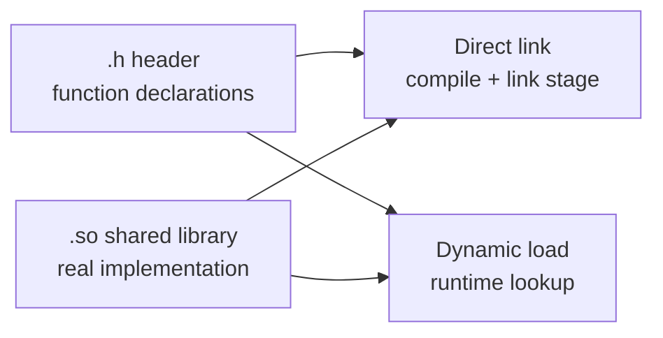

# TDS Reporter

`tds_reporter` is a standalone C++17 program that reads the vendor TDS snapshot, exports a CSV report, and sends the report through SMTP by calling `curl`.

## What It Collects

The implementation reads the `TTds_Cust_Real_Fund` snapshot and outputs:

- `cust_no`
- `cust_name`
- `dyn_rights`
- `hold_profit`
- `avail_fund`
- `risk_degree1`
- `risk_degree2`

It also keeps `fund_account_no` and `currency_code` in the CSV so duplicate customer rows remain unambiguous.

## TDS Integration

This project now keeps only one supported live integration path:

- direct link: `src/tds_client.cpp` includes `tds_api.h` and links to the vendor platform library at build time
  - RHEL8/Jenkins/release: link the vendor `tds_api.so`
  - Windows local development: link the vendor `.lib` and run with the matching `.dll`

The old dynamic-loading implementation is still preserved as a source backup only:

- `backup/tds_client_dynamic_backup.cpp`

It is not compiled, not linked, and not documented as a supported runtime mode anymore. If you ever need to revive it, you must also restore the old `tds.library_path` config field by hand.

Why direct link is preferred when the supplier can reliably provide `.h` and the platform library (`.so` on Linux, `.lib + .dll` on Windows):

- the compiler can check API signatures during build
- you get link-time errors earlier instead of runtime symbol lookup failures
- the code is simpler than manual `dlsym` handling

## Simple Diagram



Short version:

- `.h`: tells the compiler what functions and structs exist
- `.so`: contains the real implementation
- direct link: build time connects your program to the `.so`
- dynamic load: program starts first and looks up symbols later

## Configuration

The default config file path is selected by `--env`:

- `--env dev` -> `config/dev.properties`
- `--env qa` -> `config/qa.properties`
- `--env prod` -> provide `config/prod.properties`

`prod.properties.template` is included as a template. Copy it to `prod.properties` and fill the real values.

If you want to maintain only one config file, copy `config/tds_reporter.properties.template` to `config/tds_reporter.properties`. The program will prefer that file over `config/dev.properties`, `config/qa.properties`, and `config/prod.properties`. You can either replace the placeholders during install, or leave the `${ENV_VAR:default}` syntax in place and provide values through environment variables at runtime.

Two small helper scripts are included if you want to render the template into a concrete `config/tds_reporter.properties` during install or deployment:

- Linux/macOS shell: `./scripts/render-config.sh`
- Windows PowerShell: `powershell -ExecutionPolicy Bypass -File .\scripts\render-config.ps1`

Both scripts also accept optional `template` and `output` paths:

- `./scripts/render-config.sh config/tds_reporter.properties.template config/tds_reporter.properties`
- `powershell -ExecutionPolicy Bypass -File .\scripts\render-config.ps1 -TemplatePath .\config\tds_reporter.properties.template -OutputPath .\config\tds_reporter.properties`

The rendering semantics match the program itself: `${ENV_VAR:default}` resolves to the environment variable value when it exists and is non-empty; otherwise it falls back to `default`.

Properties support `${ENV_VAR:default}` syntax, so passwords can stay in environment variables instead of config files. Relative paths inside the config are resolved from the config file directory, not from the current shell directory.

Important keys:

- `tds.drtp_host` and `tds.drtp_port`: DRTP endpoint for each environment
- `tds.user` and `tds.password`: TDS login. `tds.password` may be a plain value, an `${ENV_VAR:default}` reference, or a Vault reference such as `vault://secret/tds/qa#password`
- `vault.*`: optional Vault CLI settings used when a config value references `vault://...`
- `smtp.*`: SMTP connection settings used by `curl`
- `email.default_to` and `email.default_cc`: default recipients
- `report.output_dir`: where CSV and dry-run `.eml` previews are written
- `log.dir`: runtime application log directory, default `../logs` relative to the config file
- `log.level`: `debug`, `info`, `warn`, or `error`

Application logs are written as JSON Lines to `logs/tds_reporter-YYYY-MM-DD.log`. Each line includes stable keys such as `ts`, `level`, `service`, `env`, `event`, and `msg`, so Loki can ingest and parse them directly.

The SMTP transport settings are aligned with the company JavaMailSender example:

- `smtp.port=2587`
- `smtp.security=starttls`
- `smtp.client_cert_path=/app/.cert/server.pem`
- `smtp.client_key_path=/app/.cert/server.key`

The three environment config files keep different TDS endpoints, but use the same mail transport block. The default host is intentionally left as `mta-hub.REPLACE_ME.com.cn` because the screenshot only showed the prefix and suffix. Replace it in the config file or set `SMTP_HOST`.

When `tds.password` starts with `vault://`, the program reads the secret through the local `vault` CLI. The simplest production setup is to provide `VAULT_ADDR` and `VAULT_TOKEN` through the environment. If you prefer the program to log in on demand, set `vault.auth_method=cert` or `vault.auth_method=kerberos` and fill the matching `vault.*` settings from `config/tds_reporter.properties` or environment variables.

## Build On RHEL8

Install the build tools first:

```bash
sudo dnf install -y gcc-c++ make cmake curl
```

Build:

```bash
cd /path/to/repo/tds_reporter
cmake -S . -B build \
  -DCMAKE_BUILD_TYPE=Release \
  -DTDS_VENDOR_LIBRARY=/opt/tds/lib/tds_api.so
cmake --build build --config Release
ctest --test-dir build --output-on-failure
```

On GCC 8 era toolchains such as the default RHEL8 compiler, `std::filesystem` may still require the separate `stdc++fs` compatibility library at link time. The CMake project now detects that case during configure and links it automatically. If you are building from an older checkout and see `undefined reference` errors for `std::filesystem`, add `-lstdc++fs` or update to this CMake change.

In this mode:

- `src/tds_client.cpp` includes the vendor `tds_api.h`
- the linker links against `tds_api.so`
- the build-tree executable uses the vendor library directory as `BUILD_RPATH`

## CMake Presets

The project now includes [CMakePresets.json](/D:/Codes/local/Test/tds_reporter/CMakePresets.json) so local and CI builds do not need to remember long command lines.

Available presets:

- `windows-stub-x64`: local x64 Windows build without vendor binaries
- `windows-live-x64`: local x64 Windows build that expects the supplier `win32` package to be installed
- `windows-live-x86`: local x86 Windows build for a real 32-bit supplier `win32` package
- `linux-rhel8-release`: RHEL8 release build linked against `/opt/tds/lib/tds_api.so`

Typical local Windows stub flow:

```powershell
cmake --preset windows-stub-x64
cmake --build --preset windows-stub-x64-debug
ctest --preset windows-stub-x64-debug
```

Typical local Windows live flow for **x64 vendor binaries**:

```powershell
cmake --preset windows-live-x64 -DTDS_VENDOR_LIBRARY=D:/vendor/tds/win64/tds_api.lib -DTDS_VENDOR_RUNTIME=D:/vendor/tds/win64/tds_api.dll
cmake --build --preset windows-live-x64-debug
ctest --preset windows-live-x64-debug
```

> Note: `./tds/win32` auto-detection is intentionally disabled for x64 builds to prevent `LNK4272` (x86 library vs x64 target) mismatches.

Check the configure output once:

- if you see `Windows build will enable live TDS calls`, local live mode is active
- if you still see `Windows build is stub-only`, the supplier `win32` package was not detected and you should either install it under `tds/win32/` or pass explicit library paths

If the supplier package is truly 32-bit, use the x86 preset instead:

```powershell
cmake --preset windows-live-x86
cmake --build --preset windows-live-x86-debug
ctest --preset windows-live-x86-debug
```

## Stage A Release Directory

The project now includes standard install rules plus a helper target that produces a self-contained stage directory.

To create the stage directory:

```bash
cd /path/to/repo/tds_reporter
cmake --build build --target tds_reporter_stage --config Release
```

Or with plain CMake install:

```bash
cmake --install build --prefix /tmp/tds_reporter_release
```

Practical local packaging commands:

Windows x86 package using supplier `tds/win32` files:

```bat
cd /d D:\path\to\tds_reporter
call "C:\Program Files\Microsoft Visual Studio\2022\Community\VC\Auxiliary\Build\vcvars32.bat"
cmake -S . -B build_win32_release -G "Visual Studio 17 2022" -A Win32 -DTDS_VENDOR_LIBRARY="%CD%\tds\win32\tds_api.lib" -DTDS_VENDOR_RUNTIME="%CD%\tds\win32\tds_api.dll" -DTDS_REPORTER_STAGE_DIR="%CD%\build_win32_release\stage"
cmake --build build_win32_release --config Release --parallel
ctest --test-dir build_win32_release -C Release --output-on-failure
cmake --build build_win32_release --target tds_reporter_stage --config Release
powershell -NoProfile -Command "Compress-Archive -Path 'build_win32_release\stage\*' -DestinationPath 'build_win32_release\tds_reporter-windows-x86.zip' -Force"
```

RHEL8 package using supplier `tds/linux_x86_64` files:

```bash
cd /path/to/tds_reporter
cmake -S . -B build_release -G Ninja \
  -DCMAKE_BUILD_TYPE=Release \
  -DTDS_VENDOR_LIBRARY="$PWD/tds/linux_x86_64/libtds_api.so" \
  -DTDS_REPORTER_STAGE_DIR="$PWD/build_release/stage"
cmake --build build_release --parallel
ctest --test-dir build_release --output-on-failure
cmake --build build_release --target tds_reporter_stage
tar -C build_release/stage -czf build_release/tds_reporter-rhel8-local.tar.gz .
```

The staged layout on RHEL8 is:

```text
stage/
  bin/
    tds_reporter
  lib/
    tds_api.so
    cpack.dat
  config/
    dev.properties
    qa.properties
    tds_reporter.properties.template
    prod.properties.template
  scripts/
    render-config.sh
    render-config.ps1
  logs/
  README.md
```

The installed binary uses `INSTALL_RPATH=$ORIGIN/../lib`, so after staging it will first look for the supplier shared library in the sibling `lib/` directory.

If you also do a local Windows live build, the staged layout becomes:

```text
stage/
  bin/
    tds_reporter.exe
    tds_api.dll
    cpack.dat
  config/
    dev.properties
    qa.properties
    tds_reporter.properties.template
    prod.properties.template
  scripts/
    render-config.sh
    render-config.ps1
  logs/
  README.md
```

On Windows the supplier runtime library is staged next to `tds_reporter.exe`, because Windows looks for the matching `.dll` beside the executable or on `PATH`.

Runtime prerequisites on RHEL8:

- `curl`
- `/app/.cert/server.pem`
- `/app/.cert/server.key`
- network access to the DRTP endpoint and the SMTP server

## Jenkins On RHEL8

If the build runs on a RHEL8 Jenkins node, the simplest approach is:

1. Install build tools on the node once: `gcc-c++`, `cmake`, `make`, `curl`
2. Put the supplier files in the workspace under `./tds/include` and `./tds/linux_x86_64`, or let `Jenkinsfile.release` download and extract them there
3. Make sure `./tds/linux_x86_64/libtds_api.so` and `./tds/linux_x86_64/cpack.dat` exist before the stage target runs
4. If the vendor files live elsewhere, pass `-DTDS_VENDOR_LIBRARY=/absolute/path/to/libtds_api.so`
5. Run unit tests on the node with `ctest`
6. Stage a release directory with `cmake --build build --target tds_reporter_stage`

If the supplier package is a password-protected zip, configure the release job with:

- `VAULT_ADDR`, `VAULT_AUTH_METHOD`, and the matching Jenkins credentials for either cert auth or kerberos auth
- `VENDOR_PACKAGE_PASSWORD_VAULT_PATH`
- optional `VENDOR_PACKAGE_PASSWORD_VAULT_FIELD` when the secret field is not `password`

The release pipeline uses the local `vault` CLI to read the zip password from Vault, retries `unzip` with that password, and forwards the resulting Vault token to the optional live smoke stage.
7. Archive the stage directory as the Jenkins build artifact
8. Use `--stub-file` only for non-Linux local debugging, not for the Jenkins integration build

Example declarative pipeline stage:

```groovy
pipeline {
  agent { label 'rhel8' }
  stages {
    stage('Build And Test') {
      steps {
        sh '''
          set -euxo pipefail
          cmake -S . -B build \
            -DCMAKE_BUILD_TYPE=Release
          cmake --build build --config Release --parallel
          ctest --test-dir build --output-on-failure
          cmake --build build --target tds_reporter_stage --config Release
        '''
      }
    }
  }
}
```

Recommended artifact to archive from Jenkins:

- `build/stage/bin/tds_reporter`
- `build/stage/lib/*.so*`
- `build/stage/lib/cpack.dat`
- `build/stage/config/*`

If you also want a smoke test job on Jenkins, use a real QA config:

```bash
./build/stage/bin/tds_reporter \
  --env qa \
  --config ./build/stage/config/qa.properties \
  --dry-run \
  --to qa-ops@example.com
```

This verifies config loading, direct-linked live code path creation, CSV generation, and email MIME generation without actually sending mail.

The repository now also includes ready-to-use Jenkins pipeline files:

- [jenkins/Jenkinsfile.pr](/D:/Codes/local/Test/tds_reporter/jenkins/Jenkinsfile.pr)
- [jenkins/Jenkinsfile.release](/D:/Codes/local/Test/tds_reporter/jenkins/Jenkinsfile.release)

Recommended Jenkins pipeline script paths:

- PR validation job: `jenkins/Jenkinsfile.pr`
- Release packaging job: `jenkins/Jenkinsfile.release`

Pipeline intent:

- `Jenkinsfile.pr`: configure, build, unit test, then run a deterministic `--stub-file --dry-run` smoke test
- `Jenkinsfile.release`: download the supplier install package from Artifactory with client certificate authentication, optionally read the zip password from Vault, extract the required `tds/` files into the workspace, configure, build, unit test, stage the release directory, package it as `tar.gz`, and optionally run a live DRTP dry-run smoke test with the same Vault token available to the application

## Run On RHEL8

Example using the QA config and overriding recipients from Airflow:

```bash
./build/stage/bin/tds_reporter \
  --env qa \
  --config ./build/stage/config/qa.properties \
  --to qa-ops@example.com,risk@example.com \
  --cc qa-support@example.com
```

Example sending only selected customers:

```bash
./build/stage/bin/tds_reporter \
  --env prod \
  --config /opt/tds-reporter/config/prod.properties \
  --cust-list 1001,1002,1003
```

Example dry run:

```bash
./build/stage/bin/tds_reporter \
  --env dev \
  --config ./build/stage/config/dev.properties \
  --dry-run
```

If the private key is encrypted, also set:

```bash
export SMTP_CLIENT_KEY_PASSWORD=your_key_passphrase
```

## Debug On Windows

### 1. Recommended local workflow

Windows local development now supports two modes:

- stub mode: works everywhere and is still the fastest way to debug CSV generation, MIME generation, and CLI parsing
- local live mode: works when the supplier also gives you a Windows `.lib + .dll`

If you only want fast local iteration, stub mode is enough:

```powershell
tds_reporter.exe --env dev --stub-file tests\data\stub_snapshot.csv --dry-run
```

This lets you debug:

- command-line parsing
- config loading
- CSV generation
- MIME email content
- `curl` config generation

In dry-run mode the mail server is not contacted, so the PEM certificate and key files do not need to exist on your Windows machine.

If the supplier provides a Windows runtime package, place it under `tds/win32/`:

- `tds/win32/tds_api.lib`
- `tds/win32/tds_api.dll`

The CMake project will auto-detect that directory for local Windows live builds. You can also pass the paths explicitly with `-DTDS_VENDOR_LIBRARY=...` and `-DTDS_VENDOR_RUNTIME=...`.

### 2. VS Code plugins

Install these plugins:

- `C/C++` by Microsoft
- `CMake Tools` by Microsoft
- `Remote - SSH` by Microsoft if you want to build or debug directly on the RHEL8 host from Windows

### 3. Visual Studio 2022 workload

Install the `Desktop development with C++` workload.

### 4. Build from a VS 2022 developer shell

If `cmake` is not on `PATH`, use the Visual Studio bundled one. In PowerShell, do not write `cmd /c "\"...\""`. Use this verified form instead:

```powershell
$cmd = 'call "C:\Program Files\Microsoft Visual Studio\2022\Community\VC\Auxiliary\Build\vcvars64.bat" && "C:\Program Files\Microsoft Visual Studio\2022\Community\Common7\IDE\CommonExtensions\Microsoft\CMake\CMake\bin\cmake.exe" -S D:\Codes\local\Test\tds_reporter -B D:\Codes\local\Test\tds_reporter\build'
cmd /c $cmd

$cmd = 'call "C:\Program Files\Microsoft Visual Studio\2022\Community\VC\Auxiliary\Build\vcvars64.bat" && "C:\Program Files\Microsoft Visual Studio\2022\Community\Common7\IDE\CommonExtensions\Microsoft\CMake\CMake\bin\cmake.exe" --build D:\Codes\local\Test\tds_reporter\build --config Debug'
cmd /c $cmd
```

That default command is still fine for stub-only development.

If the supplier provides a Windows `.lib + .dll`, you have two choices:

1. Put them under `D:\Codes\local\Test\tds\win32\`
2. Pass the paths explicitly:

```powershell
$cmd = 'call "C:\Program Files\Microsoft Visual Studio\2022\Community\VC\Auxiliary\Build\vcvars64.bat" && "C:\Program Files\Microsoft Visual Studio\2022\Community\Common7\IDE\CommonExtensions\Microsoft\CMake\CMake\bin\cmake.exe" -S D:\Codes\local\Test\tds_reporter -B D:\Codes\local\Test\tds_reporter\build_live -DTDS_VENDOR_LIBRARY=D:\Codes\local\Test\tds\win32\tds_api.lib -DTDS_VENDOR_RUNTIME=D:\Codes\local\Test\tds\win32\tds_api.dll'
cmd /c $cmd

$cmd = 'call "C:\Program Files\Microsoft Visual Studio\2022\Community\VC\Auxiliary\Build\vcvars64.bat" && "C:\Program Files\Microsoft Visual Studio\2022\Community\Common7\IDE\CommonExtensions\Microsoft\CMake\CMake\bin\cmake.exe" --build D:\Codes\local\Test\tds_reporter\build_live --config Debug'
cmd /c $cmd
```

When `TDS_VENDOR_RUNTIME` is set, the build copies the `.dll` next to `tds_reporter.exe` and `tds_reporter_tests.exe`, so local execution does not depend on a global `PATH` change.

If you prefer not to type the full configure and build commands, use the presets from [CMakePresets.json](/D:/Codes/local/Test/tds_reporter/CMakePresets.json) instead.

Important architecture note:

- if the supplier `win32` directory really contains 32-bit binaries, you must use an x86 toolchain for the local Windows build
- the default `vcvars64.bat` flow builds x64, so a true 32-bit `.lib` will not link there
- in that case, use an x86 developer prompt or `vcvars32.bat`, and keep that build in a separate directory such as `build_win32`

The folder also includes `.vscode/extensions.json`, `.vscode/settings.json`, and `.vscode/launch.json`. If you open `tds_reporter/` directly in VS Code, install the recommended extensions, let CMake configure the project, and then press `F5`, the default launch profile will start the program in stub dry-run mode.

### 5. Live debugging strategy

If the supplier gives you a Windows `.lib + .dll`, you can debug the real TDS call flow on Windows too. That is useful for stepping through login, snapshot retrieval, and field mapping in Visual Studio or VS Code.

Even so, the final release path is still RHEL8:

- Jenkins should still build the release artifact on a RHEL8 node and link the vendor `tds_api.so`
- the final smoke test should still run on RHEL8

Practical debugging options:

1. Use stub mode on Windows for fast iteration when you are changing report or mail logic.
2. Use local Windows live mode when the supplier also provides `.lib + .dll` and you want to debug the vendor call flow with breakpoints.
3. Use VS Code `Remote - SSH` into the RHEL8 host and run `cmake`, `gdb`, and the executable there for final Linux verification.

## Airflow Example

```bash
/opt/tds-reporter/bin/tds_reporter \
  --env prod \
  --to trading-ops@example.com,risk@example.com \
  --cc support@example.com
```

That satisfies the "same program, different recipients" requirement without changing the config file.
